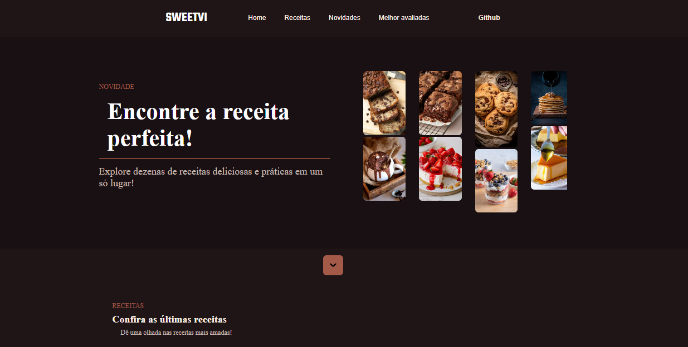
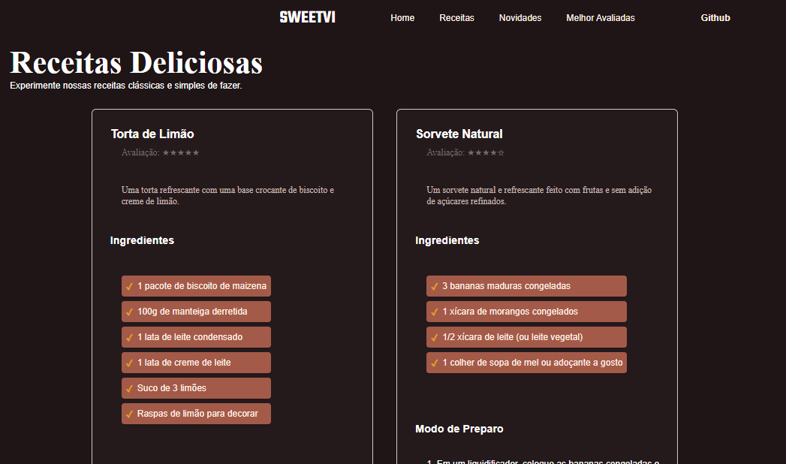

# Landing Page - Sweetvi

## Descrição
Sweetvi é uma landing page simples e moderna para um site de receitas de confeitaria. O objetivo é oferecer uma interface amigável para os usuários encontrarem receitas práticas e deliciosas. O projeto é organizado de forma a facilitar a navegação, com seções dedicadas a receitas, novidades, e receitas mais bem avaliadas.

## 🚀 [Veja a Demo Aqui](https://sweetevi-landingpage-350d1b.netlify.app/)

Clique no link acima para visualizar a página ao vivo!

## 📸 Capturas de Tela

### Página Inicial


### Receitas Deliciosas


### Receitas Melhor Avaliadas


## 🛠️ Tecnologias Utilizadas
- **HTML5**: Estrutura do conteúdo da página.
- **CSS3**: Estilos e layout da página.
- **Google Fonts**: Utilização de fontes personalizadas.
- **Visual Studio Code (VS Code)**: Ambiente de desenvolvimento.
- **Git/GitHub**: Controle de versão e hospedagem do código.

## Estrutura do Projeto
```bash
├── assets/
│   ├── imagens/               
├── index.html                 
├── receitas.html              
├── novidades.html             
├── melhor-avaliadas.html      
├── style.css                  
├── script.js                  
└── README.md                  
```

## Funcionalidades
- Página principal com imagens de receitas.
- Links para navegação (Home, Receitas, Novidades, Melhor Avaliadas).
- Seção com as receitas mais recentes e em alta.
- Responsivo e otimizado para diferentes tamanhos de tela.

[](https://app.netlify.com/sites/darling-sunflower-350d1b/deploys)
